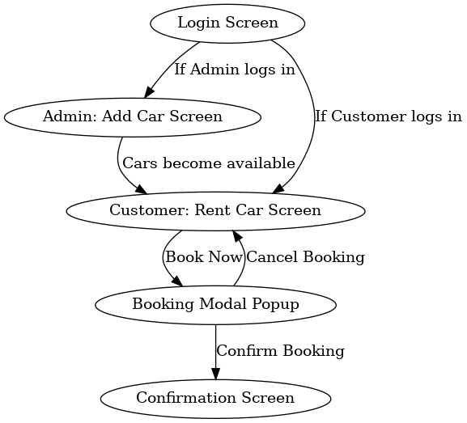

# masttask4
icetask4
index.html → main app

styles.css → pink & blue theme styling

script.js → functionality (login, add car, rent, modal popup, confirmation)

wireframe.png → navigation flow diagram

# Car Booking Service App

This is a simple **Car Booking Service App** built using **HTML, CSS, and JavaScript**.  
The app supports two types of users: **Admin** and **Customer**.

---

## Features

### 🔑 Login Screen
- Admin → Add cars to the system
- Customer → Rent a car

### 🚗 Add Car Screen (Admin)
- Add car **make, model, and cost per day**
- After adding, fields are cleared
- Cars are stored in memory for booking

### 📅 Rent a Car Screen (Customer)
- Select a car from the available list
- Enter number of days
- A **modal popup** shows the total cost
- Option to **confirm** or **cancel** booking

### ✅ Confirmation Screen
- Shows the car booked, days, and total amount due

---

## Wireframe

The navigation flow of the app is shown in the wireframe diagram:



---

## Installation & Usage

1. Download or clone this repository:
   ```bash
   git clone https://github.com/your-username/car-booking-app.git
   ```

2. Open `index.html` in your browser.

3. To edit or customize:
   - `styles.css` → change theme/colors (currently **pink & blue** theme)
   - `script.js` → logic for login, add car, booking flow

---

## Screenshots to Include
- Login Screen
- Add Car Screen (Admin)
- Rent Car Screen (Customer)
- Booking Modal Popup
- Confirmation Screen

---

## Credits
- Developed as part of **ICE Task 4**
- Teamwork allowed (worked alone)
